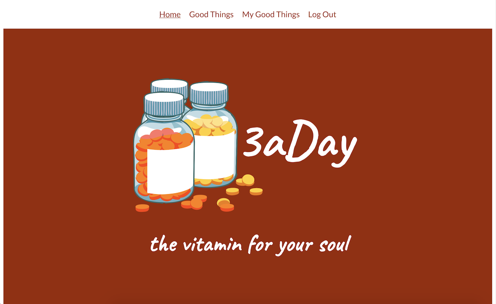
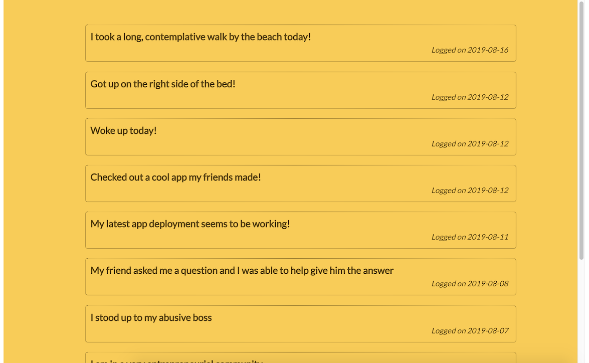
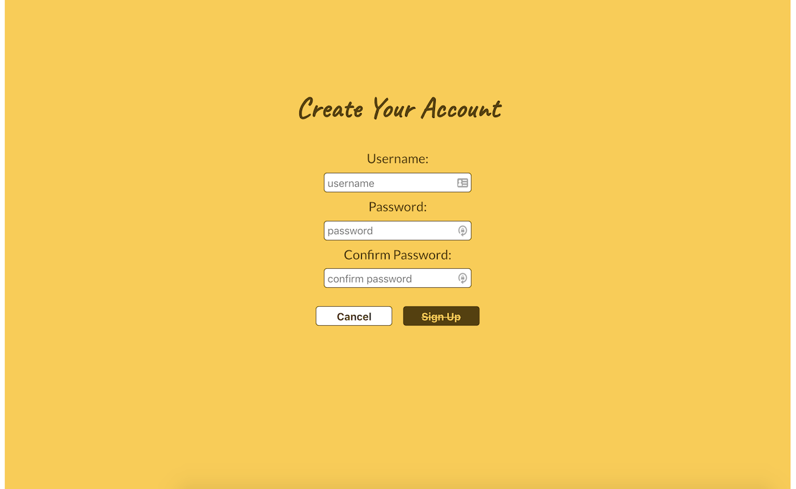
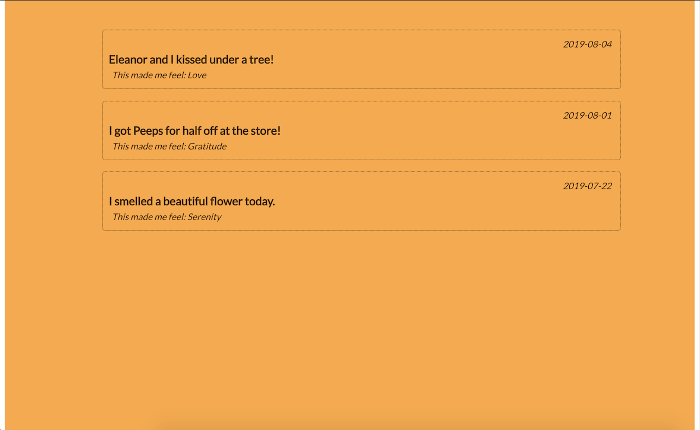
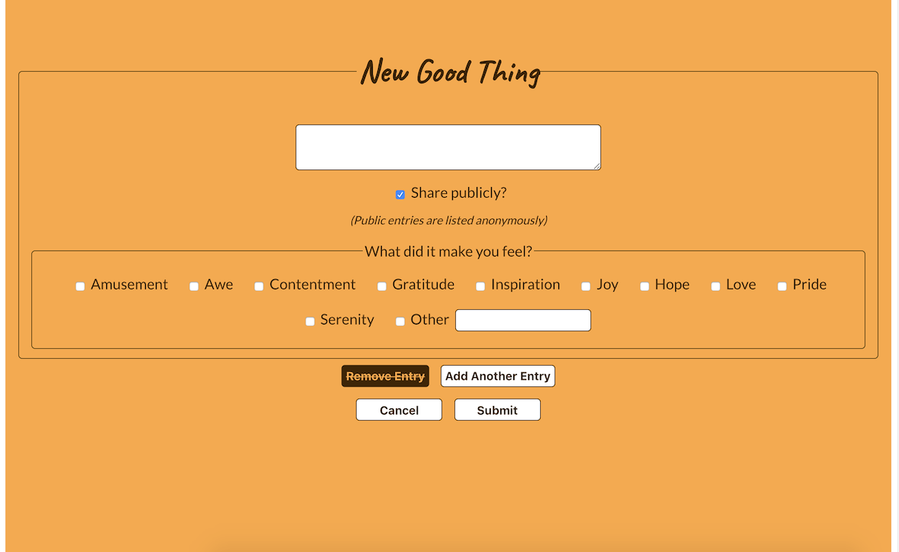

# 3aDay App

A web app for logging "Three Good Things" a day: building a daily habit of finding joy, gratitude, or other positive emotions has been proven to increase happiness and mental resilience. This app is an easy place to log your "good things", look back on your history, and get inspired by other good things in the community.

## Link

[Live Demo](https://threeaday-app.carmarsden.now.sh)

## Screenshots

### Home Page:

### View Public Entries:

View the latest "good things" that other users have submitted publicly

### Create Account:

Creating an account is quick, with limited identifying information needed

### View Your Own Entries:

Look back over your full history of "good things"

### Log New Good Things:

Reflect on your good things and how they made you feel, adding as many as you want in one submission

## Technology

### Built with:
* React, including Router
    * Created with [create-react-app](https://github.com/facebook/create-react-app)
    * Confirmation modal via [react-modal](https://github.com/reactjs/react-modal)

### API Interface:
* Built to interface with 3aDay Server: [threeaday-server](https://github.com/carmarsden/threeaday-server)